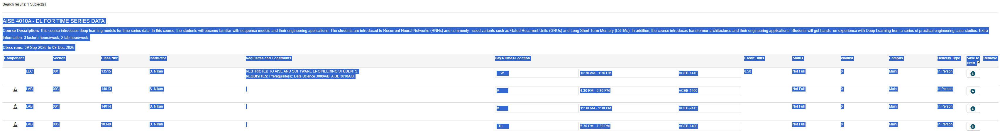
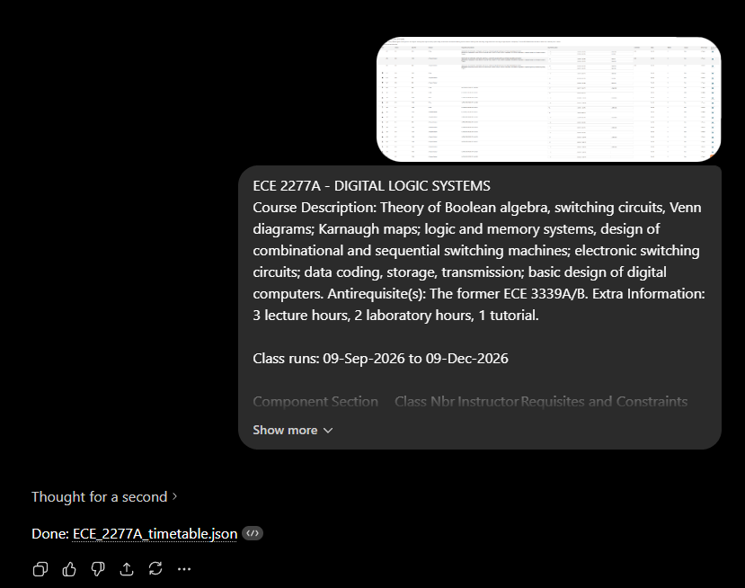

# How to Add a Course

**Read this first:** courses in this app are **not** scraped automatically from Western.

Each course is a small `.json` file stored in this repo. If the course you want isn't
already here, you (or I) have to add it. This guide shows you how — no coding required.

There are two ways to get a course in:

- **The easy way** → make the JSON file and just send it to me. I'll add it. (See [Option B](#option-b--just-send-it-to-me-easiest))
- **The full way** → make the JSON file and add it to the repo yourself with a pull request. (See [Option A](#option-a--add-it-yourself-pull-request))

Either way, **Steps 1–3 are the same.** Do those first.

## Step 1 — Find your course on Draft My Schedule

Go to **[draftmyschedule.uwo.ca](https://draftmyschedule.uwo.ca/)** and search for your course.

When you find it, you'll see a table like this — with the lecture (LEC), labs (LAB),
tutorials (TUT), times, rooms, and instructors:

Two things to grab:

1. **Take a screenshot** of the whole course block (title + all the rows).
2. **Select and copy the text** of that same block (title, times, sections — all of it).

## Step 2 — Copy the scraper prompt

Open the file **[SCRAPER_PROMPT.md](SCRAPER_PROMPT.md)** in this repo.

Copy the prompt inside it (the big quoted block under **"## Prompt"**). This is the
instruction that tells the AI how to turn your copypasta into the right JSON format.

## Step 3 — Ask an AI to build the JSON

Go to any AI chatbot slave you like (Claude, ChatGPT, Gemini — whatever).

Paste, in this order:

1. The **prompt** you copied in Step 2.
2. The **course text** you copied in Step 1.
3. The **screenshot** from Step 1.

The AI will spit out a `.json` file — here's roughly what that looks like:

**Download / save that file.** Name it after the course, e.g. `ECE_2277A_timetable.json`.

> 💡 Quick sanity check: open the file and make sure it has your course code, the right
> times, and the instructor names. If something looks off, tell the AI what's wrong and
> ask it to fix it.

## Option A — Add it yourself (pull request)

This is the "proper" way, but it's the fiddly part for non-developers. If it feels like
too much, skip to [Option B](#option-b--just-send-it-to-me-easiest).

1. **Fork the repo** — on the GitHub page for this project, click **Fork** (top right).
   This makes your own copy.
2. **Add your file** — in your fork, go into the `src/data/courses/` folder, click
   **Add file → Upload files**, and drop in the `.json` you made in Step 3.
3. **Open a pull request** — GitHub will show a **Compare & pull request** button after
   you upload. Click it, add a short note (e.g. "Add ECE 2277A"), and submit.
4. **I approve it** — once I merge it, the course goes live on the website. Done! 🎉

## Option B — Just send it to me (easiest)

Don't want to deal with GitHub? No problem. (method only works if im not busy and i like you)

**Send me the `.json` file on Discord: `janikpanik`**

I'll add it and it'll show up on the site.
